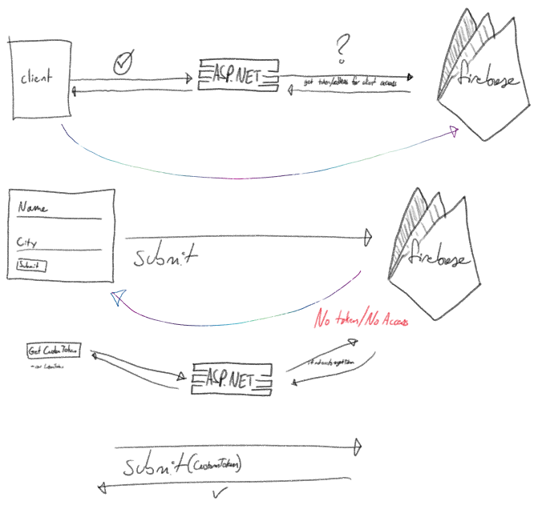

# Firebase-Auth
ASP.NET Core C# Web Application with a SQL and Firebase backend. 

Basically, I want to connect to an existing application but I want a real time connection to firebase. The tough part will be making sure that a user is authenticated through the .NET server first before getting the location of the firebase node and not being able to access parts where applicable. 

This will eventually be a good example I will base future projects on and hopfully help you with your custom projects. 

TODO/PLEASE HELP ME:
- From client javascript, send request to .NET server and return location of the firebase node to user
- Connect to firebase node from returned location from .NET server
- Display connection contents in realtime
- Make sure that this connection cannot be shared
- Add an authentication policy example
- Profit

Please follow @ajgoldenwings where applicable. 

and

Thank you -	Ashish Vishwakarma for writting https://www.c-sharpcorner.com/article/creating-c-sharp-wrapper-over-firebase-api-for-basic-crud/